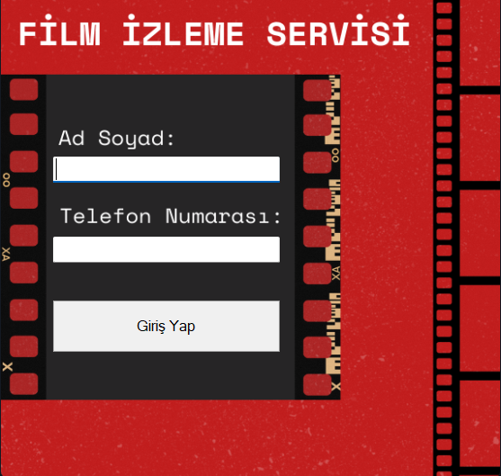
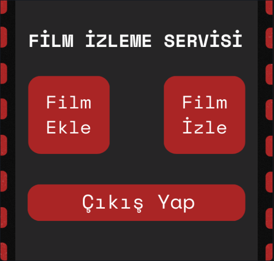
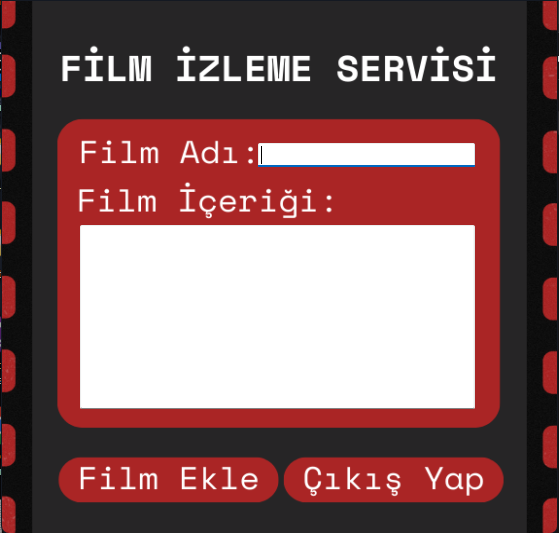

# 🎬 Film İzleme Servisi

Bu proje, **C# Windows Forms** kullanılarak geliştirilmiş bir **Film İzleme Servisi** uygulamasıdır. Kullanıcılar, sistem üzerinden film listelerine göz atabilir, film detaylarını görüntüleyebilir. Proje eğitim amaçlıdır.

## 🧩 Özellikler

- Film listesi görüntüleme  
- Film detaylarını inceleme  
- İzlenecek film seçimi  
- İzleme geçmişi takibi  
- Basit ve kullanıcı dostu arayüz  

## 🛠️ Kullanılan Teknolojiler

- C# (Windows Forms)  
- .NET Framework  
- Visual Studio  
- (Opsiyonel: JSON, XML ya da SQL Server ile veri saklama)  

## 🖼️ Uygulama İçi Ekran Görüntüleri

  
  
  

